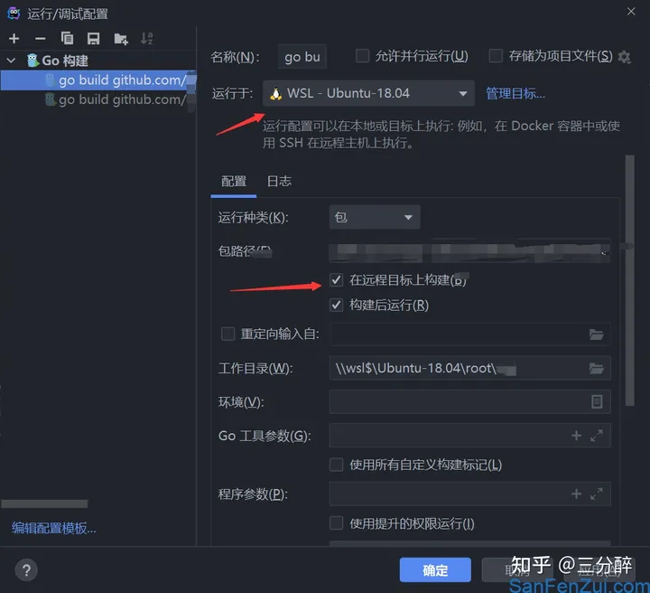

## 配置WSL


## 自动安装

```shell
sudo apt install golang-go
apt remove golang-go
```

用这样的办法自动安装的golang并非最新版

## 手动安装

1. 查看[google发布的golang版本](https://golang.google.cn/dl/)，选择合适的版本安装。

```shell
wget https://studygolang.com/dl/golang/go1.15.2.linux-amd64.tar.gz
```

2. 解压到`/usr/local`

```shell
tar -C /usr/local -xzf go1.15.2.linux-amd64.tar.gz
```

3. 设置环境变量

```shell
vim /etc/profile
```

```shell
export GOPATH=/home/xiaocai/go
export GOROOT=/usr/local/go
export PATH=$PATH:$GOROOT/bin:$GOPATH/bin
```

```shell
source /etc/profile
```

4. 其他设置

```shell
# 配置代理
go env  -w GOPROXY=https://goproxy.cn,https://goproxy.io,direct

# Go Moudle
go env -w GO111MODULE=on
```

5. 查看环境是否安装成功

```shell
go env
go version
```

## golang配置


- 添加语言运行时

- 使用`whereis go`，得到`go: /usr/local/go /usr/local/go/bin/go /mnt/d/Go/bin/go.exe`

  - 第一个参数是go sdk文件夹

  - 第二个参数`/usr/local/go/bin/go`对应Go可执行文件参数

  - 第三个是Windows10里面的go环境映射到了wsl2



- 运行/调试配置更改


