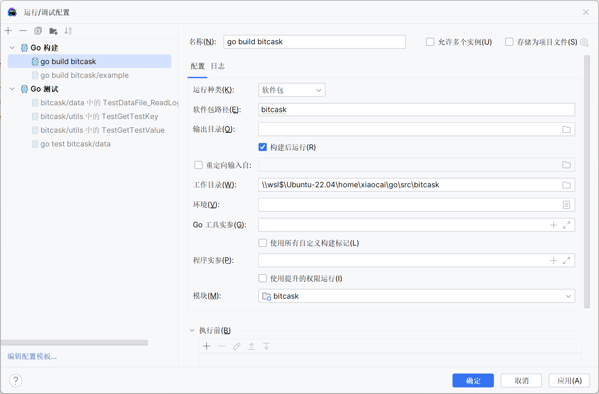

## 配置WSL

> 参考文章：[WSL安装](https://deepinout.com/wsl-tutorials/wsl-install-and-quick-start.html)

### 切换root用户

```shell
sudo passwd root
su
```

### 限制Vmmem内存

1. 按下`Windows + R`键，输入`%UserProfile%`并运行进入用户文件夹

2. 新建文件`.wslconfig`，然后记事本编辑

3. 填入以下内容并保存, memory为系统内存上限，这里我限制最大2GB，可根据自身电脑配置设置

```shell
[wsl2]
memory=4GB
swap=8GB
localhostForwarding=true
```

4. 输入`wsl --shutdown`来关闭当前的子系统，重启wsl

### 使用docker

```shell
 curl -fsSL https://test.docker.com -o test-docker.sh
 sudo sh test-docker.sh
 
 # 验证docker是否安装成功
 systemctl status docker
```

```shell
# 启动docker
systemctl start docker

# 查看当前的容器

docker ps -a

# 启动容器
docker  start 容器名或者容器id

# 停止容器
docker  stop 容器名或容器id


# 强制关闭容器
docker container kill 容器名或容器id
# 或可简写为
docker kill 容器名或容器id
```

### 配置Git

```shell
$ apt-get install libcurl4-gnutls-dev libexpat1-dev gettext \
  libz-dev libssl-dev

$ apt-get install git

$ git --version
git version 1.8.1.2
```

```shell
# 配置用户信息
git config --global user.name "shixiaocaia"​
git config --global user.email shixiaocaia@gmail.com​
git config --list

# 配置SSH
ssh-keygen -t rsa -C "这里换上你的邮箱"
# 不需要密码，直接三次回车
# 生成id_rsa和id_rsa.pub
# 添加公钥pub文件内容，到Settings -- SSH and GPG keys​
cat ~/.ssh/id_rsa.pub
# 测试配置成功
ssh -T git@github.com
```

## 自动安装

```shell
sudo apt install golang-go
apt remove golang-go
```

用这样的办法自动安装的golang并非最新版

## 手动安装

1. 查看[google发布的golang版本](https://golang.google.cn/dl/)，选择合适的版本安装。

```shell
wget https://studygolang.com/dl/golang/go1.20.5.linux-amd64.tar.gz
```

2. 解压到`/usr/local`

```shell
tar -C /usr/local -xzf go1.20.5.linux-amd64.tar.gz
```

3. 设置环境变量

```shell
vim /etc/profile
```

```shell
export GOPATH=/home/xiaocai/go
export GOROOT=/usr/local/go
export PATH=$PATH:$GOROOT/bin:$GOPATH/bin
```

```shell
source /etc/profile
```

4. 其他设置

```shell
# 配置代理
go env  -w GOPROXY=https://goproxy.cn,https://goproxy.io,direct

# Go Moudle
go env -w GO111MODULE=on
```

5. 查看环境是否安装成功

```shell
go env
go version
```

## golang配置


- 添加语言运行时

- 使用`whereis go`，得到`go: /usr/local/go /usr/local/go/bin/go /mnt/d/Go/bin/go.exe`

  - 第一个参数是go sdk文件夹

  - 第二个参数`/usr/local/go/bin/go`对应Go可执行文件参数

  - 第三个是Windows10里面的go环境映射到了wsl2



- 运行/调试配置更改


