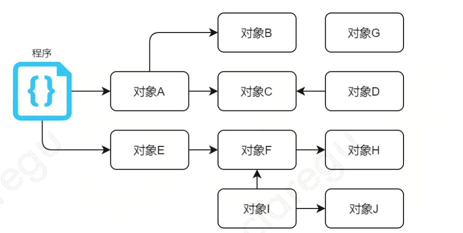
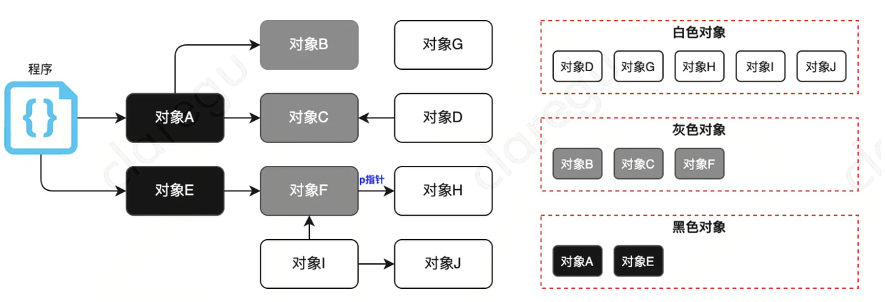
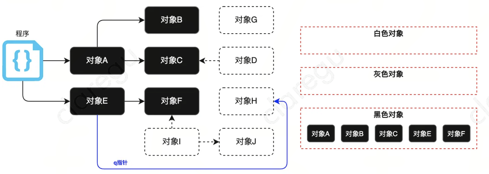
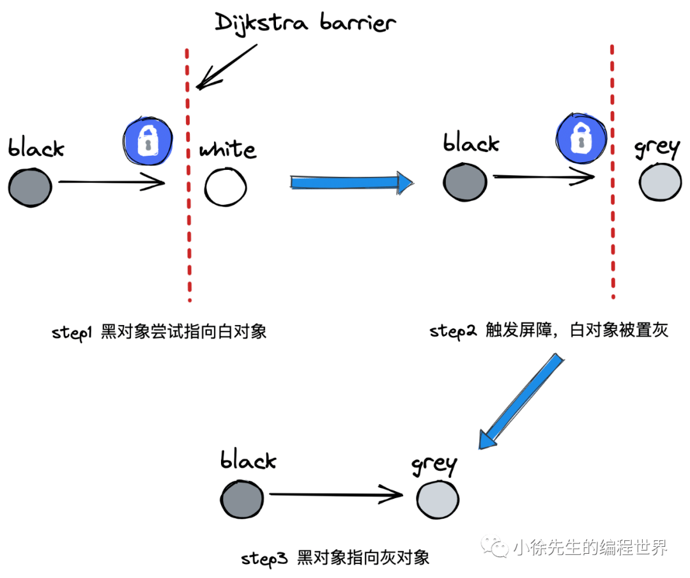
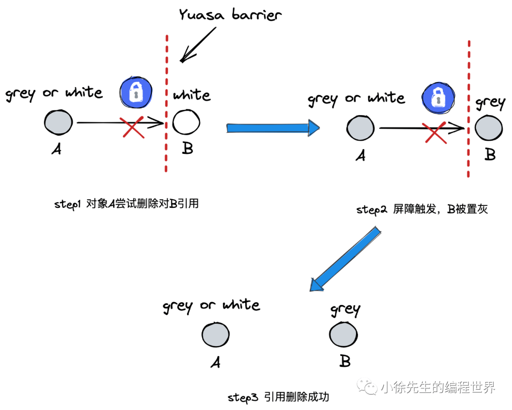

> 参考文章：
>
> 1. [小徐先生的编程世界——垃圾回收原理分析](https://mp.weixin.qq.com/s/TdekaMjlf_kk_ReyPvoXiQ)

## 背景介绍

垃圾回收（Garbage Collection，简称 GC）是一种内存管理策略，由垃圾收集器以类似**守护协程**的方式在后台运作，按照既定的策略为用户回收那些不再被使用的对象，释放对应的内存空间。

通过 GC 带来的优势：

1. 屏蔽了内存回收的细节，用户只需要专注业务逻辑
2. 以全局视野执行任务，减少开发者手动对模块间内存管理的负担

GC不足之处，提高了下限降低了上限，增加了额外成本，但是除了处理极少数对于极致速度追究的项目，GC带来的收益是极大的。

## 垃圾回收算法

1. 标记清除

- 先标记当前存活的对象，再清扫未被标记的垃圾对象；
- 不足之处，会出现**内存碎片**。

2. 标记压缩

- 在标记清扫的基础上，会将存储对象进行压缩，使得整体空间更加紧凑，解决内存碎片问题
- 但是**压缩复杂度过高**

3. 半空间复制

- 分配两片相等大小的空间，fromspace和topspace
- 每轮只使用fromspace空间，以GC划分轮次
- GC时，将fromspace存活对象转移到topspace中，进行空间压缩
- GC结束后，交换两个空间
- 在标记压缩基础上，降低了复杂度，但是**浪费空间**

4. 引用次数

- 对象每被引用一次，计数器加1
- 对象每被删除引用一次，计数器减1
- GC时，把计数器等于 0 的对象删除
- 不足之处，无法解决**循环引用或者自引用**问题，导致无法正常回收

## Golang中的垃圾回收

Golang 的gc经历了以下几个版本：

- 1.3版本前：普通标记清除法，整个gc过程需要启动 STW，效率极低

- 1.5版本：三色标记法，堆空间启动写屏障，栈空间不启动，全部扫描之后，需要重新扫描一次栈(需要 STW)，效率普通

- 1.8 版本：三色标记法，混合写屏障机制：栈空间不启动（根节点可达对象和新加入的对象全部标记成黑色），堆空间启用写屏障，整个扫描过程不要 STW，在开启和关闭写屏障时开启STW，效率高。

### 标记清除法

在**go1.3**之前采用标记清除法，从根对象出发，依次遍历对象以及子对象，标记对象的可达状态，然后清除未被标记的不可达对象，将空闲的内存加入到空闲链表中。

实现简单，但是标记前需要暂停程序（**STW，stop the world**），来避免回收写冲突问题，并且清除数据会导致内存碎片。

执行标记清除算法需要STW严重影响程序性能，因此在**1.5**版本开始，使用三色标记法来优化这个问题，支持**并发垃圾回收机制**。

### 三色标记法

为了解决标记清除算法带来的长时间的STW，多数现代的垃圾收集器都会采用三色标记算法。该算法将程序中的对象分为白色、灰色和黑色三类：

- 白色：潜在垃圾，是未被垃圾回收器访问到的对象，回收结束后，白色对象的内存会被释放
- 灰色：活跃对象，已经被垃圾回收器访问到，但存在指向白色对象的指针，需要继续访问其子对象
- 黑色：活跃对象，已经被垃圾回收器访问到，所有对象都遍历完

- 第一步应用程序开始运行时，所有对象默认标记为白色
- 第二步遍历根节点（通常是协程上的对象，全局数据区的对象），把遍历到的对象标记为灰色
  - A、E为灰色
  - 其他为白色
- 第三步遍历灰色对象，将灰色对象标记位黑色（因为他的next节点被遍历了），如果他的后继节点存在，标记为灰色（后续访问）
  - A、E为黑色
  - B、C、F为灰色
  - 其他为白色
- 第四步重复第三步，直到灰色为空
  - A、B、C、E、F、F为黑色
  - D、G、I、J为白色，不可达
- 清除所有白色

### 漏标问题

因为应用程序可能在标记执行的过程中，修改对象的引用关系，所以**为了保证对象不被错误回收**，仍需要STW。否则可能会出现漏标和多标问题。

假设当前已经完成第一轮扫描，如下图所示。此时灰色对象F通过p指针指向白色对象H。

当对象E标记为黑色，F还未扫描，创建q指针使得对象E指向白色对象H，并移除F指向H指针。

此时由于E完成了扫描，F移除了H遍历，不会遍历到H，导致H为白色不可达，被错误回收。

综上分析，在不执行STW时，满足下面两个条件下会破坏垃圾收集器的正确性：

- 条件1：某个黑色对象引用白色对象（q指针）

- 条件2：从灰色对象出发，到达白色对象的、**未经访问过的路径遭到破坏**（F--->H)

### 多标问题

同样可能出现多标问题。在E完成标记后置黑，F标记位灰色，在另一个时刻，一个协程删除了E对F的引用，F应该变成垃圾对象，但是由于E已经完成扫描，F最终被置为黑色，导致多标问题。

本该被删但仍侥幸存活的对象被称为“浮动垃圾”，至多到下一轮GC（重置标记，发现不可达），这部分对象就会被GC回收，因此错误可以得到弥补，多标问题一般可以忽略。

## 屏障技术

多标问题在下一轮GC可以得到解决，而漏标问题为了避免上述问题出现，只需要达到以下两种三色不变性的一种：

- 强三色不变性：黑色对象不会指向白色对象，只会指向灰色对象或黑色对象
- 弱三色不变性：黑色对象指向的白色对象，必须包含一条从灰色对象经由多个白色对象的可达路径

当遵循强三色不变性或弱三色不变性时，我们能够保证垃圾收集的正确性，而屏障技术就是在并发或增量标记过程中保证三色不变性的重要技术。

Go语言在垃圾收集器的演进过程中，采用Dijkstra提出的插入写屏障和Yuasa提出的删除写屏障。

### 插入写屏障

为了避免**漏标问题**，引入插入写屏障，在黑色对象引入一个白色对象时，将白色对象标记为灰色，满足强三色不变性。

对象在内存槽中有两种位置：栈和堆。栈空间的特点是容量小，但要求响应速度快，所以Go语言**没有选择启用栈上的写屏障机制**。

> 几乎大部分操作都在栈上完成，如果设置插入写屏障，写屏障需要执行的次数很多，比再扫描一遍成本高。

### 删除写屏障

删除写屏障（Yuasa barrier）的目标是实现弱三色不变式，保证当一个白色对象即将被上游删除引用前，会触发屏障将其置灰，之后再删除上游指向其的引用，解决漏标问题。

### 混合写屏障

插入写屏障、删除写屏障二者择其一，即可解决并发GC的漏标问题，至于错标问题，则采用容忍态度，放到下一轮GC中进行延后处理即可。

但是真实场景下，屏障机制无法作用于栈对象，引入STW成本过高，为此Golang1.8引入了混合写屏障：

- GC 开始前，以栈为单位分批扫描，将栈中所有对象置黑
- GC 期间，栈上新创建对象直接置黑
- 堆对象正常启用插入写屏障
- 堆对象正常启用删除写屏障

可以看[小徐先生的编程世界——垃圾回收原理分析](https://mp.weixin.qq.com/s/TdekaMjlf_kk_ReyPvoXiQ)，通过混合写屏障，保障了在栈上不会出现漏标问题，而多标问题延后处理。

> 通常，在垃圾回收的扫描阶段开始时，栈上的对象会被认为是根对象（root objects）。因为它们是从根开始的可达对象，所以要被标记为黑色。根对象通常是不可回收的，因为它们是当前执行上下文的一部分，并且引用其他对象。

## golang如何解决内存碎片问题

golang采用标记清扫算法，但是标记清扫算法会出现内存碎片问题，如何化解这一问题：

golang采用tcmalloc机制，实现将内存分块到不同的spanClass，申请时分配合适大小的块，将问题限制在可控的范围。词用采用更为简单的标记清除法，比标记压缩算法复杂度低很多。

## 有了GC是否不会发生内存泄露

不一定，当预期能够很快被释放的内存，由于附着在长期存活的内存、或生命期被意外延长，依然会导致长时间得不到回收。比如：

- 预期能被快速释放的内存因被根对象引用而没有得到迅速的释放
- 当有一个全局对象时，可能不经意间将某个变量附着在其上，且忽略释放该变量，则其内存永远不会得到释放。
- Goroutine作为一种逻辑上理解的轻量级线程，需要维护执行用户代码的上下文信息。在运行过程中也需要消耗一定的内存来保存这些信息，而这些内存在目前版本的Go语言是不会被释放的。因此，当一个程序持续不断地产生新的Goroutine、且不结束已创建的Goroutine并复用这部分内存，就会造成内存泄露的现象
