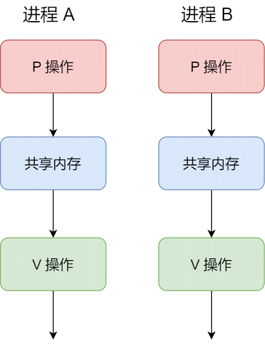
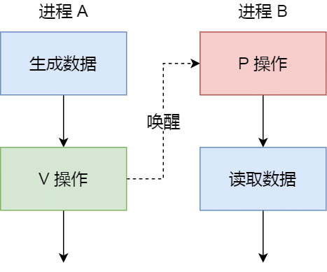

> 参考文章：
>
> 1. [小林coding](https://xiaolincoding.com/os/4_process/process_commu.html)
> 2. [Crash Course Computer Science](https://www.bilibili.com/video/BV1EW411u7th/)

## 进程间通信

每个进程之间的用户地址空间是独立的，一般不能互相访问，但是**内核空间**是每个进程都共享的，所以进程之间要通信必须通过内核。

进程间通信方式包括：

- 管道
- 信号量
- 条件变量

## 管道

### 匿名管道

```shell
ps auxf | grep mysql
```

在上述中`|`就是一个管道，通过管道将前一个输出作为下一条指令的输入，由此可见匿名管道是**单向的**。如果想要相互通信，需要创建两个管道。

匿名管道是**单向的**（单个管道），**只存在内存中**，相当于**内核中的一串缓存**，读写都是在内核中完成，并且是**无格式的流并且大小受限**。

### 命名管道

与匿名管道对应是命名管道，也被叫做FIFO（是一个先进先出的数据结构），使用前需要通过`mkfifo pipiName`来创建管道，实际是以**文件**形式存在。

命名管道是阻塞读写的，写入后必须等待另一个进程读出，才会恢复，因此通信方式效率低，不适合进程间频繁地交换数据。

### 跨进程通信

通常当我们使用匿名管道进行进程间通信，需要创建两个管道，才能完成。

匿名管道是如何跨进程通信的：

- 在一个进程中，通过fork创建子进程，子进程会复制父进程的文件描述符，实现了父进程和子进程分别持有fd[0]和fd[1]，实现跨进程通信。
- 同时为了避免同时读写的混论问题，通常关闭一段读端只保留写端，一端只保留读端关闭写端。

以上是通过两个匿名管道实现进程间通信，在shell中并不是这样的，`A | B`都是shell创建出的子进程，不存在父子进程关系，但他们的父进程都是shell，实现了进程间通信。

对于没有实体文件的匿名管道，通信范围局限在父子进程当中，通过fork来复制父进程的文件描述符，实现通信。

对于命名管道，可以通过文件在不相关的进程间实现通信，不同进程可以打开创建的FIFO文件来访问同一个管道进行通信，结束后需要关闭管道释放相关资源。

无论是匿名管道还是命名管道，最终数据都是存放在内核当中。

## 消息队列

通过管道的通信效率低（**写入数据会阻塞，直到数据被读取**），不适合频繁交换数据。消息队列可以解决这个问题。

数据写入时写入到**内核中的消息链表**，并且消息的发送方和接收方要约定好消息体的数据类型，所以每个消息体都是固定大小的存储块，不像管道是无格式的字节流数据。

当进程从消息队列中读取了消息体，内核会把这个消息体删除。消息队列需要手动释放或者等待操作系统关闭。

但是消息队列仍有两个不足：

- 不适合大数据的传输，因为内核中每个消息体都有最大长度限制，最终导致队列的消息体的总长度也有限制。
- 存在用户态与用户态的数据拷贝开销，数据写入到内核中的消息队列和读取，都需要涉及用户态和内核态之间数据的拷贝。

## 共享内存

现代操作系统，通过虚拟内存技术，每个进程都有独立的虚拟内存空间，分别映射到不同的物理空间，不影响相互的使用。

共享内存通过使用一片虚拟地址空间，映射到相同的物理内存中，不需要发生拷贝问题，提高了进程间通信的速度。

###  信号量

通过共享内存的方式解决了用户态和内核态拷贝问题，但是带来了多个进程读写同一个共享内存的的冲突问题。

为了防止多进程竞争共享资源，而造成的数据错乱，使用信号量来保护共享的资源任意时刻只被一个进程访问到。

**信号量是一个整型的计数器，主要用于实现进程间的互斥与同步，而不是用于缓存进程间通信的数据**。

信号量表示**资源的数量**，控制信号量的有两种操作：

- P操作：信号量-1，之后如果信号量 < 0，表示资源已被占用，需要阻塞等待；如果大于等于0，表示资源可以用，进程正常执行。
- V操作：信号量+1，如果信号量仍然小于等于0，说明有阻塞中的进程，于是会唤醒进程执行（前面阻塞等待的）；否则表明当前没有阻塞的进程。



> 通过将资源信号量初始值设为1，作为互斥信号量。
>
> 1. 进程A在访问共享内存时，执行P操作，信号量 = 0，说明资源可以访问
> 2. 另一时刻，进程B也想访问共享内存，执行P操作，信号量 = -1，说明资源已被占用，阻塞等待
> 3. A执行完后，执行V操作，信号量 = 0，说明有进程阻塞等待访问共享内存，唤醒B执行
> 4. B执行完后，执行V操作，信号量 = 1，结束。

此外，通过信号量也可以实现多进程同步方式，典型的例子生产者消费者模型。



> 设置资信号量初始值为0
>
> - 如果进程B先消费，执行P操作，信号量 = -1，阻塞等待
> - 进程A生产数据，执行V操作，信号量 = 0，说明有阻塞等待，唤醒B消费

## 信号

信号量时常规状态下的工作模式，对于异常模式下需要用**信号**来通知进程。

Linux提供了几十种信号，用于给进程发送信号。如果进程在后台运行，在知道进程PID号时，可以通过kill命令给进程发送信号。例如`kill -9 1050`，给PID为1050的进程发送SIGKILL信号，来结束进程。

信号事件的来源主要有硬件来源（如键盘 Cltr+C ）和软件来源（如 kill 命令）。

信号是进程间通信机制中**唯一的异步通信机制**，因为可以在任何时候发送信号给某一进程，一旦有信号产生，我们就有下面这几种，用户进程对信号的处理方式。

**1.执行默认操作**。Linux 对每种信号都规定了默认操作，例如，上面列表中的 SIGTERM 信号，就是终止进程的意思。

**2.捕捉信号**。我们可以为信号定义一个信号处理函数。当信号发生时，我们就执行相应的信号处理函数。

**3.忽略信号**。当我们不希望处理某些信号的时候，就可以忽略该信号，不做任何处理。有两个信号是应用进程无法捕捉和忽略的，即 `SIGKILL` 和 `SEGSTOP`，它们用于在任何时候中断或结束某一进程。

信号量和信号量并不是直接用于缓存进程间通信的数据。

## Socket

前面提到的管道、消息队列、共享内存、信号量和信号都是在同一台主机上进行进程间通信，那要想**跨网络与不同主机上的进程之间通信，就需要 Socket 通信了。**

根据创建 socket 类型的不同，通信的方式也就不同：

- 实现 TCP 字节流通信： socket 类型是 AF_INET 和 SOCK_STREAM；
  - 需要经过TCP三次握手，结束后需要通过close关闭
  - 服务端监听一个socket用于接受客户端连接，accept后返回一个用于socket的通信的文件描述符
- 实现 UDP 数据报通信：socket 类型是 AF_INET 和 SOCK_DGRAM；
  - UDP 是没有连接的，所以不需要三次握手，也就不需要像 TCP 调用 listen 和 connect，但是 UDP 的交互仍然需要 IP 地址和端口号，因此也需要 bind。
- 实现本地进程间通信
  - 通过绑定一个本地文件实现

## 线程间通信

同个进程下的线程之间都是共享进程的资源，只要是共享变量都可以做到线程间通信，比如全局变量，所以对于线程间关注的不是通信方式，而是关注多线程竞争共享资源的问题，信号量也同样可以在线程间实现互斥与同步：

- 互斥的方式，可保证任意时刻只有一个线程访问共享资源；
- 同步的方式，可保证线程 A 应在线程 B 之前执行。
