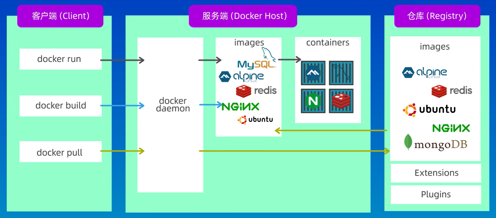

> [GeekHour Docker入门教程](https://www.bilibili.com/video/BV14s4y1i7Vf?p=1&vd_source=98edb319e59affabde4d9cb2731826cd)

## Docker和虚拟机区别

虚拟机是物理机通过Hypervisor虚拟化技术实现的，将物理机器虚拟成多个虚拟化的服务器，虚拟化的服务器包含了完整的操作系统、CPU、硬盘等资源。

Docker是容器一种实现，容器是一种虚拟化技术。和虚拟机类似，可以在这个虚拟环境中运行程序，但是使用宿主机的操作系统，占用较少的资源。

## 基本原理



- images：一个只读的模板，可以用来创建容器。
- container：docker运行的实例，提供一个独立可以移植的环境。
- registry：仓库集中存储分享docker镜像，比如dockerhub。
- docker-daemon：服务端守护进程，管理docker资源，处理请求返回给客户端。
- docker-client：发送请求。

## Docker基本使用

### 创建Dockerfile

```dockerfile
FROM node: 18-alpine # 精简的操作系统
WORKDIR /app
COPY ..
RUN npm install
CMD node src/index.js
EXPOSE 3000
```

```shell
docker build -t hello-docker:1.1 .
# hello-docker是image-name, 可以指定版本号，'.'当前路径
# 生成的docker-image 
```

### 基本命令

```shell
docker image ls # 查看所有镜像

docker run hello-docker # 运行镜像

docker pull geekHour/hello-docker # 拉取镜像
```

## Docker.Compose.yaml

自动配置相互关联的容器，使用`docker compose up`启动、停止、重建服务。
