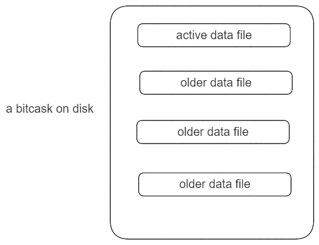
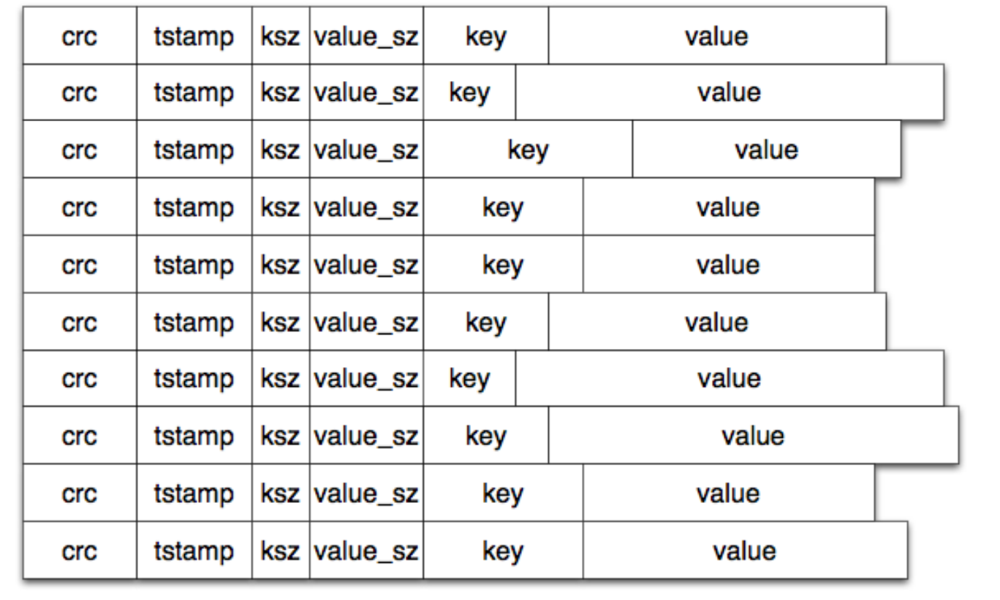
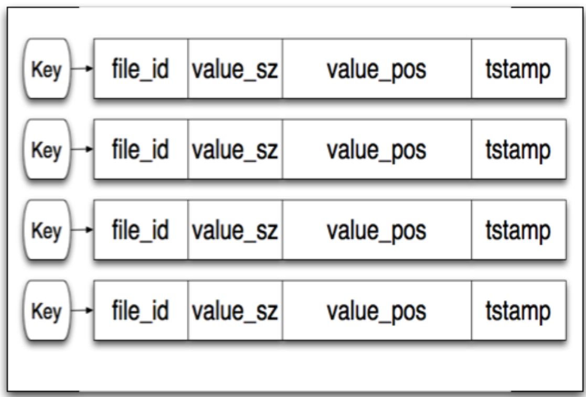
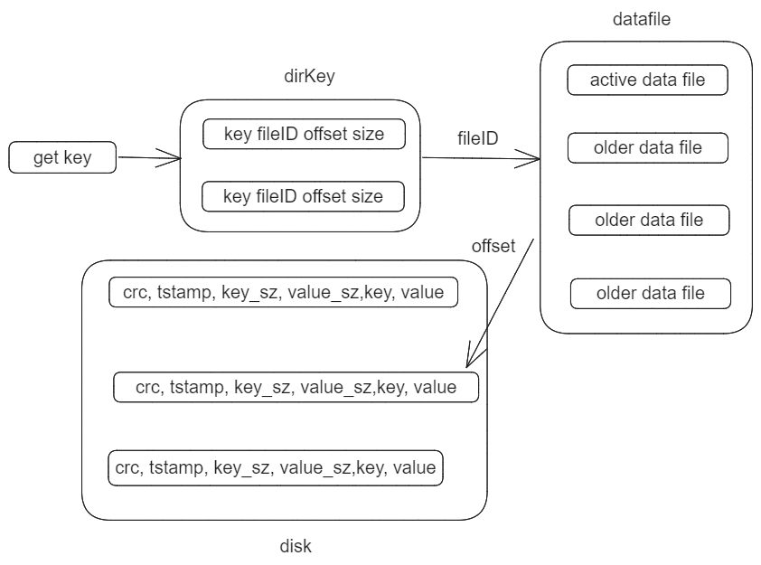

## Bitcask模型背景

bitcask 存储模型最初是由一个做分布式存储系统的商业化公司 Riak 提出来的。

Riak 有很多产品，其中就包括一个分布式 KV 存储系统 Riak KV，他们的分布式 KV 产品具有可插拔的存储引擎，可以独立于整个系统，单独开发和测试新的存储引擎。

基于此，他们想打造一个全新的存储引擎，在最理想的情况下，满足下面的这些条件：

- 读写低延迟

- 高吞吐，特别是对大量的随机写入

- 能够处理超过内存容量的数据

- 崩溃恢复友好，能够保证快速恢复，尽量不丢数据

- 简单的备份和恢复策略

- 相对简单、易懂的代码结构和数据存储格式

- 在大数据量下，性能有保障

- 能够有自由的授权使用在 Riak 的系统中

现有的存储引擎，没有一个能够很好的满足这些条件，于是 Riak 团队重新设计了一个简洁高效的存储引擎[bitcask](https://riak.com/assets/bitcask-intro.pdf)。

## 存储模型实例



Bitcask存储引擎最初的设计目标并不是追求最高的性能，而是追求足够的性能以及高质量、简单的代码设计和文件格式。

> However, our initial goal with Bitcask was not to be the fastest storage engine but rather to get ”enough” speed and also high quality and simplicity of code, design, and file format. 

最终实现的一个存储引擎实例，就是系统上的一个目录，并且限制同一时刻只能有一个进程进行写入。将一个进程看作数据库的服务端。

> 这边在后续自己实现时，简化为每次只允许一个进程打开，通过文件锁来实现，读写操作并发问题通过锁保证。

### 数据文件

在这个目录当中，存在多个数据文件，具体分为活跃文件和旧的数据文件（后续称为旧文件）：

- 活跃文件仅存在打开数据库时，用于追加写入数据，追加写入性能更高。
- 活跃文件写入一定数据量时，活跃文件转为旧文件，旧文件主要用于数据读取。

在每个数据文件中存储了具体的记录信息：



- crc：数据校验，防止数据被破坏、篡改等
- timestamp：写入数据的时间戳
- ksz：key size，key 的大小
- value_sz：value size，value 的大小
- key：用户实际存储的 key
- value：用户实际存储的 value

对于Put相当于写入一条记录到活跃文件，而Delete写入一条特殊的墓碑记录，标记前面的记录失效，而不是直接删除某条数据。在下次Merge过程中，才会清理无效的数据。

### 内存索引

回顾Bitcask模型的设计初衷，”能够处理超过内存容量的数据“，所以Bitcask在内存索引中维护Value实际是存储在磁盘中的文件ID，偏移，记录大小。



在数据追加写入到磁盘当中后，更新内存中的数据结构keydir，实际上就是key的一个集合，存储是key到磁盘文件的位置。

keydir中存放了一条数据在磁盘中最新的数据，尽管旧的数据仍然存在，在加载或者更新时会使用最新的数据，在后续merge操作中清理无效数据。

> 在论文中提到使用哈希表来存储，这里可以自由选择，常见可以选择BTree，B+Tree，ART，跳表等。
>
> 例如哈希表，可以更高效的获取数据，但是无法遍历数据，如果想要数据有序遍历，可以选择 B 树、跳表等天然支持排序的数据结构。

### 数据读写



在了解完数据文件和内存索引后，数据读取也清晰明了。首先根据key从内存中找到对应的记录，拿到记录实际在磁盘中的位置，根据位置找到磁盘中对应的数据文件，获取到完整的数据返回。

由于旧的数据实际上一直存在于磁盘文件中，因为我们并没有将旧的数据删掉，而是新追加了一条标识其被删除的记录。因此论文当中提出了merge过程清理无效数据，避免旧的数据过多。merge 会遍历所有不可变的旧数据文件，将所有有效的数据重新写到新的数据文件中，并且将旧的数据文件删除掉。

此外，由于数据存放在磁盘文件中，每次需要手动加载数据到内存索引中。当数据积累到一定量时，如果发生数据库重启，加载时间过长对业务造成一定的影响，因此论文当中提出，在merge过程中将有效数据写入到一个hint文件中，hint文件类似数据文件，不过它存储的时记录的位置信息。

当bitcask启动时，直接加载hint文件中的数据，再加载未合并的数据，从而达到快速构建索引目的。

### API接口

```shell
// 打开一个 bitcask 数据库实例，使用传入的目录路径
// 需要保证进程对该目录具有可读可写权限
bitcask::Open(Directory Name);

// 通过 Key 获取存储的 value
bitcask::Get(Key);

// 存储 key 和 value
bitcask::Put(Key, Value);

// 删除一个 key
bitcask::Delete(Key);

// 获取全部的 key
bitcask::list_keys();

// 遍历所有的数据，执行函数 Fun
bitcask::Fold(Fun);

// 执行 merge，清理无效数据
bitcask::Merge(Directory Name);

// 刷盘，将所有缓冲区的写入持久化到磁盘中
bitcask::Sync();

// 关闭数据库
bitcask::Close();
```

## 整体回顾

Bitcask存储引擎是一个KV存储引擎，相比于Redis，通过将实际Value维护在磁盘中，能够处理超过内存容量的数据。

回顾论文开头，Riak 团队提出的期望：

- 首先，bitcask 很快，查询和写入都很快，因为读写都只有一次磁盘 IO
- 写入数据还是顺序 IO，保证了高吞吐
- 内存中不会存储实际的 value，因此在 value 较大的情况下，能够处理超过内存容量的数据
- 提交日志和数据文件实际上就是同一个文件，数据的崩溃恢复能够得到保证
- 备份和恢复非常简单，只需要拷贝整个数据目录即可
- 设计简洁，数据文件格式易懂、易管理

总体来说，bitcask 基本满足了设计的要求，是一个简洁优雅、高效的存储引擎。

