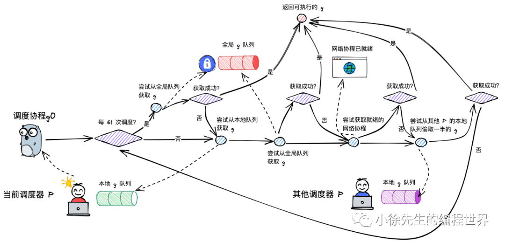

> 参考资料
>
> 1. [小徐先生的编程世界——Golang GMP 原理](https://mp.weixin.qq.com/s/jIWe3nMP6yiuXeBQgmePDg)
> 1. [刘丹冰博客](https://learnku.com/articles/41728)

## 进程、线程、协程

### 进程

进程是运行起来的可执行程序，运行一个程序会创建一个或者多个进程；

- 创建进程，需要分配栈区、文件映射区等空间，所以说进程是资源分配的最小单位；
- 每个进程有自己的独立地址空间，不与其他进程分享，但是进程间的线程彼此共享同一个虚拟地址空间；
- 如果需要实现进程通信方式，需要使用管道、共享内存、信号量、信号等机制。

### 线程

通常语义下，指的是内核级的线程。

- 是操作系统调度的基本单位；
- 创建、销毁、调度由内核完成，cpu需要在内核态和用户态之间切换；

- 同一个进程下的线程共享内核空间的资源；

- 可充分利用多核、实现并行。

### 协程

协程（coroutine）是线程的子集，是用户态线程。

- 与线程存在映射关系，将线程资源进一步划分，看成M：1关系；
- 创建、销毁、调度由用户态完成，对内核透明；
- 从属于同一个内核级线程，无法并行。一个协程阻塞会导致从属同一个线程的所有协程无法执行；
  - 发生阻塞时，对于操作系统来说看成是一个线程发生阻塞，无法察觉是一个协程阻塞

协程与线程的区别：

- 协程相比线程来说更小，只有2k大小，可以允许更多的协程来实现高并发
- 协程的上下文切换不需要经过用户态到内核态的转换，且保存的寄存器值更少，上下文切换成本小，效率高
- 通过语言层面的内置协程调度器，利用多个线程实现了协程并行

## Goroutine

goroutine是从普通的coroutine演变过来的，做了如下优化：

- 通过在中间增加了调度器，实现协程与线程存在映射关系，为 M：N；
- 通过设置多个调度器利用多个线程，实现协程并行；
- 通过调度器的斡旋，实现和线程间的动态绑定和灵活调度；
- 栈空间大小可动态扩缩，因地制宜。

## GMP模型

GMP 是go语言协程调度模型，其由协程 goroutine + 内核线程 machine + 逻辑处理器 processor 构成，通过调度器P将可执行的协程 G 放到对应的工作线程 M 上调度执行。


### 具体构成

- g = goroutine，是 golang 对协程的抽象
  - g 有自己的运行栈、状态、以及执行的任务函数（用户通过 go func 指定）
  - g 需要绑定到 p 才能执行，在 g 的视角中，p 就是它的 cpu
- p = processor，是 golang 中的调度器
  - 对 g 而言，p 是其 cpu，g 只有被 p 调度，才得以执行
  - 对 m 而言，p 是其执行代理，为其提供必要信息的同时（可执行的 g、内存分配情况等），并隐藏了繁杂的调度细节
  - p 的数量决定了 g 最大并行数量，通过 GOMAXPROCS 进行设定（超过 CPU 核数时无意义），任意时刻都只有 $GOMAXPROCS 个 goroutine 在同时运行
- m =  machine，是 golang 中对线程的抽象
  - m 不直接执行 g，而是先和 p 绑定，由其实现代理
  - 借由 p 的存在，m 无需和 g 绑死，也无需记录 g 的状态信息，因此 g 在全生命周期中可以实现跨 m 执行
  - go程序启动时，会设置 M 的最大数量，默认 10000。 但是内核很难支持这么多的线程数，所以这个限制可以忽略
  - 当一个m发生阻塞，去寻找空闲的 M，如果没有会创建新的 m，去接管之前的P，避免阻塞m中的其他阻塞
- 全局队列：存放等待运行的 G，本地存放不下的G会放到这里
- P 的本地队列：同全局队列类似，存放的也是等待运行的 G，存的数量有限，不超过 256 个。新建 G’时，G’优先加入到 P 的本地队列，如果队列满了，则会把本地队列中一半的 G 移动到全局队列
- P 列表：所有的 P 都在程序启动时创建，并保存在数组中，最多有 GOMAXPROCS(可配置) 个

- g0：是特殊的调度协程，不执行用户函数，负责执行 g 之间的切换调度，每个M有一个对应的g0

### 实现细节

- M调度G前需要和P绑定，优先取P本地队列，其次取全局队列，最后取wait队列（为io阻塞就绪态goroutine队列）；这样的好处是，优先取本地队列时，可以接近于无锁化，减少全局锁竞争。
- 为防止不同P的闲忙差异过大，设立work-stealing机制，本地队列为空的P可以尝试从其他P本地队列偷取一半的G补充到自身队列，实现负载均衡。
  - 由于存在窃取情况，所以本地队列中还是需要考虑加锁，但是相比全局队列所有P都可能访问，发生概率很低，接近无锁化情况
  - 全局队列当中，所有P都可能访问，所以需要加锁避免并发问题

### 数据结构

g的数据结构如下：

```go
type g struct {
    // ...
    m         *m      
    // ...
    sched     gobuf
    // ...
}
```

m对应后续绑定的执行线程，可以进行动态调整


整个goroutine生命周期包括如上几个状态：

- 当goroutine创建时处于gidle，完成初始化后进入gdead状态
- 当g可以执行，等待调度进入grunnable状态
- 成功被调度，进入grunning，执行逻辑
  - 当代码逻辑涉及内核态操作，会进入gsyscall系统调用的状态，阻塞等待，完成后又进入grunnable可执行等待调度的状态
  - 有时可能涉及并发未获取到锁，进入gwaiting阻塞等待
- g成功调度执行完，进入gdead状态

m的数据结构如下：

```c
type m struct {
    g0      *g     // goroutine with scheduling stack
    // ...
    tls           [tlsSlots]uintptr // thread-local storage (for x86 extern register)
    // ...
}
```

- 对于一个m，包含了特殊的调度协程go，不用于执行用户函数，负责执行 g 之间的切换调度， 与 m 的关系为 1:1
- tls：thread-local storage，线程本地存储，存储内容只对当前线程可见。 线程本地存储的是 m.tls 的地址，m.tls[0] 存储的是当前运行的 g，因此线程可以通过 g 找到当前的 m、p、g0 等信息

p的数据结构如下：

```go
type p struct {
    // ...
    runqhead uint32
    runqtail uint32
    runq     [256]guintptr
    
    runnext guintptr
    // ...
}
```

- runq对应一个P的本地队列，是一个双向队列
- runqhead：队列头部
- runqtail：队列尾部
- runnext：下一个可执行的 goroutine

```go
type schedt struct {
    // ...
    lock mutex
    // ...
    runq     gQueue
    runqsize int32
    // ...
}
```

schedt 是全局 goroutine 队列的封装：

- lock：一把操作全局队列时使用的锁；

- runq：全局 goroutine 队列；

- runqsize：全局 goroutine 队列的容量.

## 调度流程

### 两种goroutine

goroutine主要分为两类：

- 负责调度普通 g 的 g0，执行固定的调度流程，与 m 的关系为一对一
- 负责执行用户函数的普通 g

m 通过 p 调度执行的 goroutine 永远在普通 g 和 g0 之间进行切换，当 g0 找到可执行的 g 时，会调用 gogo 方法，调度 g 执行用户定义的任务；当 g 需要主动让渡或被动调度时，会触发 mcall 方法，将执行权重新交还给 g0。

### 调度类型


- 主动调度
  - 用户主动使用`Gosched`让出当前P的执行权，g投递到全局队列当中
  - 此时g0重新获取到执行权，获取可执行的下一个g
- 被动调度
  - 因当前不满足某种执行条件，g 可能会陷入阻塞态无法被调度，直到关注的条件达成后，g才从阻塞中被唤醒，重新进入可执行队列等待被调度。常见阻塞方式：加锁、有缓存的通道阻塞等待
  - 当一个 g 需要进入被动调度状态，通过 gopark 陷入 gwaiting 状态，底层通过 mcall 将执行权归还给 g0
  - 同时当前p和g进行解绑，g0获取下一个可以执行调度g
  - 当g完成阻塞时，可以被唤醒时，通过某个p的g0调度到，将g尝试加入到主动唤醒操作（goready）的P本地队列当中
- 正常调度
  - g 中的执行任务已完成，g0 会将当前 g 置为死亡状态，发起新一轮调度
- 抢占调度
  - 前面的操作，主要通过g0在用户态范围进行切换。抢占主要由一个全局监控者g完成，将某个执行系统调用时间过长的g与当前p进行解绑
  - 某个 g 发起内核切换，由线程身份进入内核态发起系统调用，所以此时 m 由于系统调用陷入僵持态，此时对应 m 的 g0 无法得到执行，所以需要一个全局g来完成操作
  - 全局 g 会把 P 抽离出去，尝试与其他m进行绑定执行，不影响之前的 m 和 g ，把 P 拿出去继续调度执行
  - 这里发生抢占调度时机，主要判断当前是否为空闲状态，一般本地队列有需要执行的 g，或者没有空闲的 p 和 m 时，处于忙碌状态需要考虑抢占调度，也要看发生系统调用的时长是否过长

### 宏观调度


gmp一个从g0-->g-->过程，主要包含以下几个步骤：

- g0 执行 schedule() 函数，寻找到用于执行的 g
- g0 执行 execute() 方法，更新当前 g、p 的状态信息，并调用 gogo() 方法，将执行权交给 g
- g 因主动让渡( gosche_m() )、被动调度( park_m() )、正常结束( goexit0() )等原因，调用 m_call 函数，执行权重新回到 g0 手中
- g0 执行 schedule() 函数，开启新一轮循环

### findRunnable



寻找可执行g进行调度额过程：

- 为了避免一直执行本地队列，导致全局队列g的搁置。p 每执行 61 次调度，会从全局队列中获取一个 goroutine 进行执行。同时这其中涉及一些系统调用，比如gc等，所以实际会在61之前从全局中获取。
- 首先尝试从 p 本地队列中获取一个可执行的 goroutine，并且这个过程需要加锁
  - 由于存在work-stealing机制，需要加锁保正并发安全。窃取动作不会频繁发生，获取锁的概率很高，接近无锁化操作。
- 如果本地队列没有可执行的g，从全局队列中获取
- 倘若本地队列和全局队列都没有 g，则会获取准备就绪的IO协程
- 如果上述还没有，尝试从其他P的本地队列，偷取一半的g
  - 一共会发起四次尝试，某一次成功即返回
  - 偷取过程中会随机遍历P的起点位置，跳跃遍历，保证公平性
  - 窃取目标P本地队列的一半，移动其头指针更新被偷取的队列信息

### execute

- 更新 g 的状态信息，建立 g 与 m 之间的绑定关系

- 更新 p 的总调度次数

- 调用 gogo 方法，执行 goroutine 中的任务

