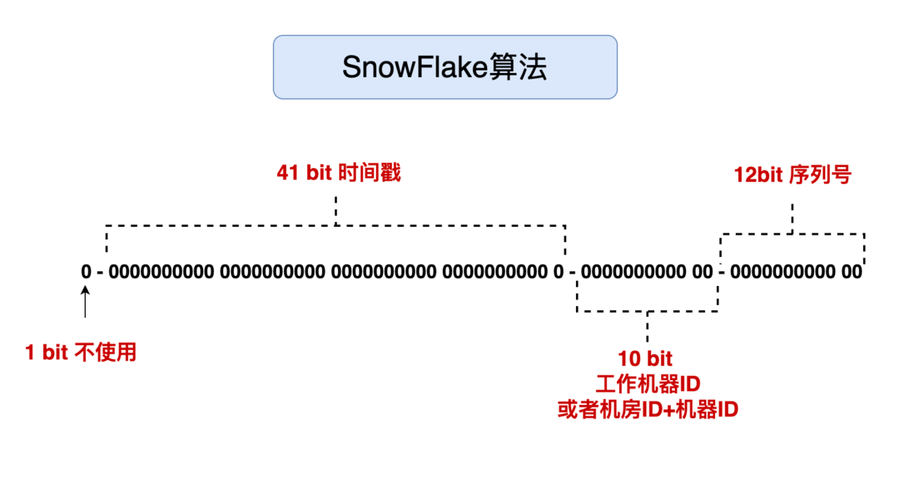

> 参考文章
>
> - [Leaf——美团点评分布式ID生成系统](https://tech.meituan.com/2017/04/21/mt-leaf.html)

## 背景

在复杂分布式系统中，需要对大量的数据和消息进行**唯一标识**，比如美团点评的金融、支付、餐饮等产品系统，淘宝的订单号...

单纯的数据库自增ID无法满足需求：

1. ID冲突问题：在跨数据中心的分布式系统中，由于网络延迟和其他因素，单纯的数据库自增ID很难确保全局唯一性
2. 单点故障：如果数据库出现问题或宕机，那么新的ID将无法生成，从而影响整个系统的可用性
3. ID预测问题：因为自增ID是连续的，恶意用户可能会尝试预测下一个ID，从而可能进行某种形式的攻击或数据抓取
4. 迁移和备份问题：在数据迁移或备份恢复的过程中，自增ID可能会带来问题，因为原始的ID序列可能会被打破
5. ...

一个好的ID生成系统应该满足什么：

- 平均延迟和TP999延迟都要尽可能低
- 可用性5个9
- 高QPS

> 常用的性能评价指标：
>
> - QPS：每秒钟处理的查询或请求数量
> - TPS：每秒钟处理的事务数量。事务的定义可以根据上下文而变，但通常指的是一个完整的操作，例如从数据库中读取或写入数据。
> - RT：系统响应请求所需的时间
> - Latency：数据从源点到目的地的传输时间

## UUID

UUID(Universally Unique Identifier)的标准型式包含32个16进制数字，以连字号分为五段，形式为8-4-4-4-12的36个字符，示例：`550e8400-e29b-41d4-a716-446655440000`。

存在几种不同版本的UUID，每个版本都有自己的生成方法。最常用的版本是v1（基于时间和机器的MAC地址）和v4（基于随机数）

优点：性能高，基于本地生成，没有网络传输消耗。

缺点：

- 过长不易于存储：UUID本身包含32个16进制数，算上4个连字符，二进制下需要（32 + 4 ） * 4 = 144位
- 信息不安全：基于MAC地址生成UUID的算法可能会造成MAC地址泄露
- 不适合作为DB主键，过长、无序性
  - MySQL官方有明确的建议主键要尽量越短越好
  - 作为主键时，有序性能够保证数据在物理上的顺序，提高数据的读取效率；在InnoDB的B+树索引下，支持主键的有序性能够保证范围查询的效率；每次插入新数据时，都是插入到主键索引的最后一个位置，这样就避免了数据移动和索引重建的开销

## 雪花算法

### 1. 组成

雪花算法是由Twitter开源的分布式ID生成算法，以划分命名空间的方式将 64-bit位分割成多个部分，每个部分代表不同的含义。

- 1位符号位，始终是0，使得ID始终为正
- 41位时间戳，具体到毫秒，41位的二进制可以使用69年
- 10位机器标识，10位最多可以表示1024台机器，**雪花算法的Id唯一性主要靠机器码保证**
  - 如果对IDataCenter（互联网数据中心）有需求，可以将 10bit 分 5bit 给 IDC，分5bit给工作机器workerId，worker可以是进程、线程、协程等
  - 在多个数据中心中使用相同的机器编号，由于 IDC 标识符的不同，也不会出现冲突，如果超过限制可能出现机器码重复，导致同一毫秒内生成重复ID
  - 可以采用本机IPv4地址最后两段以及进程Id一起作为机器码，确保机房内部不同机器，以及相同机器上的不同进程，拥有不同的机器码
  - 如果要保证绝对不相同的机器码，可以通过手动设置唯一的workerID方式来实现
- 12位序列号，可表示2^12 = 4096个数

### 2. 优缺点

优点：

- 毫秒数在高位，自增序列在低位，整个ID都是趋势递增的，后续插入数据库的索引树的时候，性能较高
- 生成ID时不依赖于数据库，完全在内存生成，高性能高可用
- 可以根据自身业务特性分配bit位，非常灵活

缺点：

- 强依赖机器时钟一致性，如果机器上时钟回拨，会导致发号重复或者服务会处于不可用状态
  - 回拨时间小的时候，不生成 ID，循环等待到时间点到达
  - 提前预留出拓展位，从机器Id，序列号中腾出位数。回拨时间过长，利用拓展位，回拨之后在拓展位上加1就可以了，这样ID依然可以保持唯一
  - 美团针对这个提出了Leaf方案，百度提出UidGenerator方案
- 在当第三部分的机器的数量超过机房的个数限制了，导致机器码重复，同一毫秒内，两个使用相同机器ID和数据中心ID的机器可能会产生完全相同的ID

### 3. 相关问题

1. workerId 怎么保证唯一？机器号是预先分配的，那实际中机器上下线情况，这个机器开始抢占了一个，后来下线了，新上来的机器如何分配？

   - 可以通过分布式缓存来保存机器ID和workId之间的映射关系。启动的时候访问分布式缓存查询当前机器ID对应的workId，如果查询不到则获取一个并保存到分布式缓存中

   - 可通过Zookeeper管理workId，免去手动频繁修改集群节点，去配置机器ID的麻烦。当新机器上线时，它可以从ZooKeeper请求一个机器号；当机器下线时，这个号可以被回收并在未来重新分配
   - 如果采用静态配置方案，每个机器号都是预先分配的，即使机器下线，机器号也不会重新分配，新机器加入只能手动分配
2. 雪花算法1s之内最多可以生成多少个不同的ID
   - 12bit位序列号，可以标识2^12=4096个ID，一个节点在1秒内最多可以生成：4096×1000=4,096,000，约400万个Id
   - 考虑到10位机器标识允许多达1024个节点，所以如果每个节点都达到最大生成能力，那么系统在1秒内总共可以生成：4,096,000×1024=4,194,304,000，越41亿

## MySQL生成

## Leaf算法

## 如何实现一个分布式ID生成的服务功能

