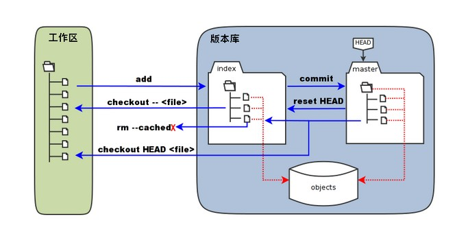
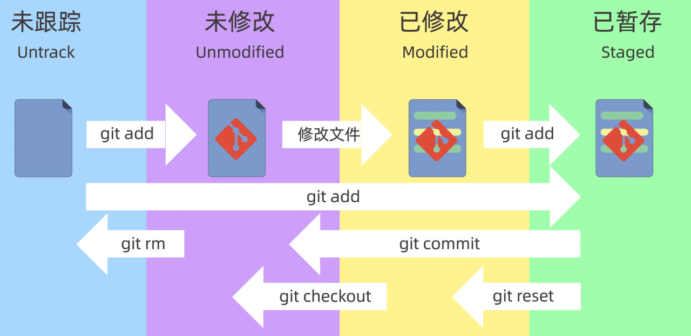

> 参考文章
>
> [GeekHour Git教程](https://www.bilibili.com/list/watchlater?oid=528356813&bvid=BV1HM411377j&spm_id_from=..top_right_bar_window_view_later.content.click&p=9)

## 环境配置

```shell
# 配置SSH
ssh-keygen -t rsa -C "这里换上你的邮箱"
# 不需要密码，直接三次回车
# 生成id_rsa和id_rsa.pub
# 添加公钥pub文件内容，到Settings -- SSH and GPG keys
cat ~/.ssh/id_rsa.pub
# 测试配置成功
ssh -T git@github.com 

# 输入yes
The authenticity of host 'github.com (20.205.243.166)' can't be established.
ED25519 key fingerprint is SHA256:+DiY3wvvV6TuJJhbpZisF/zLDA0zPMSvHdkr4UvCOqU.
This key is not known by any other names.
Are you sure you want to continue connecting (yes/no/[fingerprint])? yes

Warning: Permanently added 'github.com' (ED25519) to the list of known hosts.
Hi shixiaocaia! You've successfully authenticated, but GitHub does not provide shell access.

# GitHub中添加SSH id_rsa.pub内容
# 再次验证
ssh -T git@github.com 

# Hi shixiaocaia! You've successfully authenticated, but GitHub does not provide shell access.
```

1. 下载Git，Win/Liunx...
2. 配置用户信息

```shell
# 配置用户信息
git config --global user.name "shixiaocaia"
git config --global user.email shixiaocaia@gmail.com
git config --list
```

3. 设置全局代理

```shell
git config --global http.proxy socks5://127.0.0.1:10808
git config --global https.proxy socks5://127.0.0.1:10808
```

4. 配置SSH

```shell
ssh-keygen -t rsa -C "这里换上你的邮箱"
# 不需要密码，直接三次回车
# 生成id_rsa和id_rsa.pub
# 添加公钥pub文件内容，到Settings -- SSH and GPG keys
# Linux下显示私钥内容
cat ~/.ssh/id_rsa.pub
# 测试配置成功
ssh -T git@github.com 

# 输入yes
The authenticity of host 'github.com (20.205.243.166)' can't be established.
ED25519 key fingerprint is SHA256:+DiY3wvvV6TuJJhbpZisF/zLDA0zPMSvHdkr4UvCOqU.
This key is not known by any other names.
Are you sure you want to continue connecting (yes/no/[fingerprint])? yes

Warning: Permanently added 'github.com' (ED25519) to the list of known hosts.
Hi shixiaocaia! You've successfully authenticated, but GitHub does not provide shell access.

# GitHub中添加SSH id_rsa.pub内容
# 再次验证
ssh -T git@github.com 

# Hi shixiaocaia! You've successfully authenticated, but GitHub does not provide shell access.
```

## 工作区域




- workspace：实际操作的目录
- staging area：暂存区，临时存放修改
- local Repository：本地代码，版本信息
- Remote Repository：远程仓库

---

一开始创建文件，是未跟踪状态，通过`git add .`添加到暂存区

- `git commit`只会提交暂存区的内容，不会提交工作区内的内容，所以需要先`git add.`添加所有文件到暂存区，再提交
- `git ls-files`查看暂存区内容
- `git log`查看commit记录，`git log --oneline`查看简洁提交记录
- `git rest`回退到某一个版本
  - --soft，保留工作区和暂存区
  - --hard，删除两个版本之间工作区和暂存区的内容
  - --mixed，只保留工作区内容，清空暂存区内容
  - 指令后面跟上版本号，比如``git rest --hard 234asda``
  - 如果误操作了Git，`git -reflog`操作的历史记录，然后使用`git rest --hard 234asda`回退误操作之前的命令
- `git diff`默认查看工作区和暂存区之间的差异内容
  - `git diff HEAD`查看工作区和最新提交之间的之间的差异
  - `git diff --cached`查看工作区和版本库之间的差异
  - `git diff 234asd 123asda` 比较不同提交的差异，或者比较提交和HEAD的差异
  - `git diff HEAD~ HEAD` 查看当前提交和上一个提交的差异，波浪线后可以加数字表示前几个版本
- 删除操作，先删除本地文件，再提交，删除暂存区的记录
  - `git rm <file>`，同时删除工作区和暂存区记录
  - `git rm --cached <file>`删除暂存区记录
  - 删除后记得提交

## 常用命令

### init

```shell
git init

git remote add origin url / ssh
# 使用ssh连接不需要登陆验证

git pull -u origin main
# 拉取origin的main分支到本地main分支
# -u 将远程仓库和本地仓库关联起来
```

- 如果使用git clone同步项目到本地，而上述更多是从直接将本地文件夹与远端仓库建立连接
- 初始化后的.git文件夹，通过`ls -a`显示，包含了仓库的信息，一般隐藏避免删除
- `git remote -v`获取远程仓库信息

### branch

```shell
# 查看本地分支
git branch
# 查看远程分支
git branch -r
# 查看所有分支
git branch -a

# 切换到test分支
git checkout test
# 推荐使用switch切换分支，checkout具有恢复功能，容易引起误解
git switch test

# 创建分支
git branch hello

# 创建并切换分支
git branch -b main

# 删除分支
git branch -d local_branch_name
git branch origin :remote_branch_name
# :表示删除
# 如果是未被合并的命令，需要通过-D来强制删除

# 查看分支属于哪部分拉出来的
git reflog --date=local | grep <branchname> 
```

### pull

```shell
# 拉取最新的origin代码
git fetch origin 

# 基于某个远程分支创建新的本地分支
git checkout -b main origin/main
```

### push

```shell
# 拉取最新远程代码到本地
git fetch

# 合并最新代码
git merge origin/main

# git pull = git fetch & git merge origin main
git pull <远程主机名> <远程分支名>:<本地分支名>
# 一般本地分支名和远程分支名相同时，合并分支名
```

- 在不同分支下开发，不需要先merge主分支的内容，通过提交PR，完成和主分支的合并
- 当开发新功能，从主分支拉取，过程中可能也会pull最新代码

### gitignore

```shell
touch .gitignore

git rm  --cached xxx
# 添加 xxx/

git commit -m"gitignore"
git push origin main
```

- 哪些文件应该被忽略
  - 系统或者软件自动生成的文件
  - 编译产生的中间文件和结果文件
  - 运行时生成的日志文件、缓存文件、临时文件
  - 涉及身份、密码、口令、密钥等敏感信息文件
- 将需要忽略的文件写入到gitignore文件当中，**如果文件已经存在版本库当中，需要先删除，才能生效**
  - git rm  --cached xxx删除记录
- 根据官方的gitignore的不同语言版本进行修改

### merge VS rebase

- 当产生冲突时，需要处理冲突部分文件，再重新提交merge后的结果（git add  + commit 冲突文件）
- 使用git merge，最后会生成一个merge提交记录


- git rebase
  - 在dev分支下，git rebase main会把两个分支的交界点开始，后的dev:1，dev:2分支内容移动到main的head头节点之后，并且此时总的分支为dev
  - 对比左侧和右侧，右侧最终合并后的分支记录全部保存到main当中
  - git switch/checkout branch，决定了最终分支名
  - git rebase branch，决定了交界点之后，以那一条线为主线，移动另一条线到最后
- git rebase和git merge区别
  - git merge不会破坏原分支的提交记录，方便回溯和查看。缺点是产生额外的提交节点，分支图比较复杂
  - git rebase不需要新增额外的提交记录，形成线性历史，直观和干净。缺点会改变提交历史，改变当前分支branch out的节点，**避免在共享分支中使用**。
  - 如果是一个人开发，为了提交记录的清晰明了，使用git rebase

## GitFlow模型


- 主要分支
  - main/master分支：可以部署发布
  - develop分支：最新开发状态
- 辅助分支
  - feature: **开发新功能**的分支, 基于 develop, 完成后 merge 回 develop；
  - release: 辅助版本发布的分支, 用来**测试修复** bug，基于 develop, 完成后 merge 回 develop 和 master
  - hotfix: **修复 main 上的问题**,  基于 master, 完成后 merge 回 master 和 develop
- 通过git-flow使用
- GitFlow模型分支管理严格，代码合并清晰，适合中大型团队使用，但是分支流程过多较为复杂

## Github Flow模型


- 主要维护一个主分支master/main，是随时可以部署发布的内容
- 需求新增基于master分支，合并到master分支需要PR，master分支内容一经合并，可以立即部署使用
- 相比前者分支足够简单，但不适合多版本产品线使用
