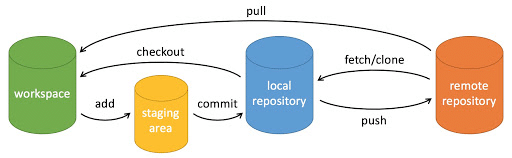
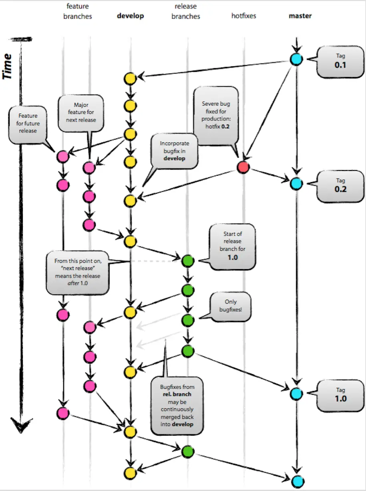
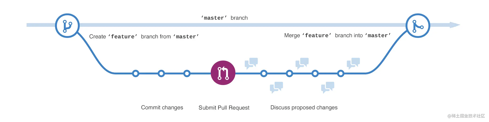

> 参考文章
>
> [GeekHour Git教程](https://www.bilibili.com/list/watchlater?oid=528356813&bvid=BV1HM411377j&spm_id_from=..top_right_bar_window_view_later.content.click&p=9)
>
> [菜就多练](https://learngitbranching.js.org/?locale=zh_CN)
>
> [CSDN-工作中如何使用Git的](https://juejin.cn/post/6974184935804534815#heading-15)

## 环境配置

```shell
# 配置SSH
ssh-keygen -t rsa -C "这里换上你的邮箱，备注信息"
# 不需要密码，直接三次回车
# 生成id_rsa和id_rsa.pub
# 添加公钥pub文件内容，到Settings -- SSH and GPG keys
cat ~/.ssh/id_rsa.pub
# 测试配置成功
ssh -T git@github.com 

# 输入yes
The authenticity of host 'github.com (20.205.243.166)' can't be established.
ED25519 key fingerprint is SHA256:+DiY3wvvV6TuJJhbpZisF/zLDA0zPMSvHdkr4UvCOqU.
This key is not known by any other names.
Are you sure you want to continue connecting (yes/no/[fingerprint])? yes

Warning: Permanently added 'github.com' (ED25519) to the list of known hosts.
Hi shixiaocaia! You've successfully authenticated, but GitHub does not provide shell access.

# GitHub中添加SSH id_rsa.pub内容
# 再次验证
ssh -T git@github.com 

# Hi shixiaocaia! You've successfully authenticated, but GitHub does not provide shell access.
```

1. 下载Git，Win/Liunx...
2. 配置用户信息

```shell
# 配置用户信息
git config --global user.name "shixiaocaia"
git config --global user.email shixiaocaia@gmail.com
git config --list
```

3. 设置全局代理

```shell
git config --global http.proxy socks5://127.0.0.1:10808
git config --global https.proxy socks5://127.0.0.1:10808
```

4. 配置SSH

```shell
ssh-keygen -t rsa -C "这里换上你的邮箱"
# 不需要密码，直接三次回车
# 生成id_rsa和id_rsa.pub
# 添加公钥pub文件内容，到Settings -- SSH and GPG keys
# Linux下显示私钥内容
cat ~/.ssh/id_rsa.pub
# 测试配置成功
ssh -T git@github.com 

# 输入yes
The authenticity of host 'github.com (20.205.243.166)' can't be established.
ED25519 key fingerprint is SHA256:+DiY3wvvV6TuJJhbpZisF/zLDA0zPMSvHdkr4UvCOqU.
This key is not known by any other names.
Are you sure you want to continue connecting (yes/no/[fingerprint])? yes

Warning: Permanently added 'github.com' (ED25519) to the list of known hosts.
Hi shixiaocaia! You've successfully authenticated, but GitHub does not provide shell access.

# GitHub中添加SSH id_rsa.pub内容
# 再次验证
ssh -T git@github.com 

# Hi shixiaocaia! You've successfully authenticated, but GitHub does not provide shell access.
```

## 工作区域




- workspace：工作区，实际操作的目录；
- staging area / index：暂存区，临时存放修改，通过`git add`命令添加工作区文件到暂存区；
- local Repository：本地仓库，通过`git commit` 提交暂存区内容，会进入本地仓库；
- Remote Repository：远程仓库，用来托管代码。

---


- 一开始创建文件，是未跟踪状态，通过`git add .`添加到暂存区，每次修改后都需要`git add . `添加到暂存区

- `git ls-files`查看暂存区内容

- `git commit`提交暂存区的内容到本地仓库
  
  - 不会提交工作区内的内容，所以需要先`git add.`添加所有文件到暂存区，再提交
  - `git commit -m "your message"`，记录备注信息
  
- `git log`查看commit记录，`git log --oneline`查看简洁提交记录

- `git reflog`

  ```shell
  $ git reflog
  8718541 (HEAD -> main) HEAD@{0}: reset: moving to 87185414b36cf347c173d0063a721ebf7a9e5737
  8718541 (HEAD -> main) HEAD@{1}: reset: moving to 87185414b36cf347c173d0063a721ebf7a9e5737
  8718541 (HEAD -> main) HEAD@{2}: commit: tt
  884fc87 HEAD@{3}: commit: test2
  c7d1abc HEAD@{4}: commit: test
  8bbcf7c HEAD@{5}: reset: moving to HEAD
  8bbcf7c HEAD@{6}: commit (amend): test2
  ```

  - 输出`HEAD@{6}`，是相对当前时间的索引位置，越大数字代表越早的操作，可以用`HEAD@{6}`或者8718541哈希值来定位


- `git reset`回退到某一个版本，默认上一个版本
  - --soft，保留工作区和暂存区
  - --hard，删除两个版本之间工作区和暂存区的内容
  - --mixed，只保留工作区内容，清空暂存区内容
  - 指令后面跟上版本号，比如`git reset --hard 234asda`
  - 如果误操作了Git，可以通过`git reflog`查看操作的历史记录，使用`git reset --hard 234asda`回退误操作之前的命令
- `git diff`默认查看工作区和暂存区之间的差异内容
  - `git diff HEAD`查看工作区和最新提交之间的之间的差异
  - `git diff --cached`查看工作区和版本库之间的差异
  - `git diff 234asd 123asda` 比较不同提交的差异，或者比较提交和HEAD的差异
  - `git diff HEAD~ HEAD` 查看当前提交和上一个提交的差异，波浪线后可以加数字表示前几个版本
- 删除操作，先删除本地文件，再提交，删除暂存区的记录
  - `git rm <file>`，同时删除工作区和暂存区记录
  - `git rm --cached <file>`删除暂存区记录
  - 删除后记得提交

## 常用命令

### init

```shell
git init

git remote add origin url / ssh
# 使用ssh连接不需要登陆验证

git pull -u origin main
# 拉取origin的main分支到本地main分支
# -u 将远程仓库和本地仓库关联起来
```

- 如果使用git clone同步项目到本地，而上述更多是从直接将本地文件夹与远端仓库建立连接
- 初始化后的.git文件夹，通过`ls -a`显示，包含了仓库的信息，一般隐藏避免删除
- `git remote -v`获取远程仓库信息

### commit

```shell
# 提交暂存的更改，会新开编辑器进行编辑
git commit 
# 提交暂存的更改，并记录下备注
git commit -m "you message"
# 等同于 git add . && git commit -m
git commit -am
# 对最近一次的提交的信息进行修改,此操作会修改commit的hash值
git commit --amend
```

### branch

```shell
# 查看本地分支
git branch
# 查看远程分支
git branch -r
# 查看所有分支
git branch -a

# 切换到test分支
git checkout test
# 推荐使用switch切换分支，checkout具有恢复功能，容易引起误解
git switch test

# 创建分支
git branch hello

# 创建并切换分支
git branch -b main

# 删除分支
git branch -d local_branch_name
git branch origin :remote_branch_name
# :表示删除
# 如果是未被合并的命令，需要通过-D来强制删除

# 重命名分支
git branch -m <old-branch-name> <new-branch-name>

# 查看分支属于哪部分拉出来的
git reflog --date=local | grep <branchname> 
```

### pull

```shell
# 拉取最新的origin代码
git fetch

# 拉取并更新本地
git fetch origin main:local_branch

# 基于某个远程分支创建新的本地分支
git checkout -b main origin/main
```

### push VS fetch

```shell
# 拉取最新远程代码到本地，获取特定分支变化
git fetch <远程主机名> <分支名>

# 合并最新代码
git merge origin/main

# git pull = git fetch & git merge origin main
git pull <远程主机名> <本地分支名>:<远程分支名>
# 一般本地分支名和远程分支名相同时，合并分支名

# 用rebase 替代 merge，保证公共代码合并到当前分支是线性的
git pull --rebase
```

- 在实际中进行PR之前，需要fetch最新的，然后rebase origin/main，将分支变基到目标分支的最新版本，以便包含最新的变更
- 如果过程中产生冲突，按序解决
  - 处理产生冲突的文件
  - git add 文件名，标记处理完的文件，这里会创建一个虚拟提交，不需要手动的commit
  - git rebase --continue，这个过程中是一个个处理变基commit，可能发生多次冲突。继续执行rebase操作，重复执行
  - git push origin test_branch --force，处理完成后


### gitignore

```shell
touch .gitignore

git rm  --cached xxx
# 添加 xxx/

git commit -m"gitignore"
git push origin main
```

- 哪些文件应该被忽略
  - 系统或者软件自动生成的文件
  - 编译产生的中间文件和结果文件
  - 运行时生成的日志文件、缓存文件、临时文件
  - 涉及身份、密码、口令、密钥等敏感信息文件
- 将需要忽略的文件写入到gitignore文件当中，**如果文件已经存在版本库当中，需要先删除，才能生效**
  - git rm  --cached xxx删除记录，删除暂存区内文件
- 根据官方的gitignore的不同语言版本进行修改

### merge VS rebase

```shell
     D---E test
    /
A---B---C---F master
```

- git merge

  ```shell
       D--------E
      /          \
  A---B---C---F---G    test , master
  ```

  - 当产生冲突时，需要处理冲突部分文件，再重新提交merge后的结果（`git add  + commit`冲突文件），会生成一次提交G
  - 融合代码到公共分支时使用git merge，而不是git rebase


- git rebase

  ```shell
   A---B---D---E---C `---F` test , master
  ```

  - 在master下执行rebase，会以master为合并后的分支，将test分支内容以交界点变基到master上，老的提交没有销毁不能再被访问或者使用；
  - 产生冲突需要逐个处理，`git add .` `git rebase -continue`，或者`git rebase -skip`忽略当前冲突；
  - rebase后当前分支会与线上分支不同（加入了新的commit），需要`--force`强制；
  - `git rebase -i HEAD~4`，用于合并多次提交记录，注意是从上往下；
  - 融合代码到个人分支时候使用`git rebase`，可以不污染分支的提交记录，形成简洁的线性提交历史记录。
  
- git rebase和git merge区别
  - git merge不会破坏原分支的提交记录，方便回溯和查看，缺点是产生额外的提交节点，分支图比较复杂；
  - git rebase不需要新增额外的提交记录，形成**线性历史**，直观和干净。缺点会改变提交历史，需要处理多次冲突问题；
  - 公共代码-->个人分支：git rebase，线性提交记录；个人分支-->公共代码：git merge；

- 常见的公共分支，master分支，feature是个人分支

### git cherry-pick

- 用于获取某个分支的单个提交，引入到当前分支来，可以同时合并多个，不连续的分支
- 其实可以基于rebase实现一部分

### reset VS revert

`git reset`回退到某一个版本，默认上一个版本

- --soft，保留工作区和暂存区
- --hard，删除两个版本之间工作区和暂存区的内容
- --mixed，只保留工作区内容，清空暂存区内容
- 指令后面跟上版本号，比如`git reset --hard 234asda`
- 如果误操作了Git，可以通过`git reflog`查看操作的历史记录，使用`git reset --hard 234asda`回退误操作之前的命令

`git revert`撤销某一次commit，同时新增一条commit记录，reset过于暴力。

对于个人的 feature 分支而言，可以使用 `git reset` 来回退历史记录，之后使用 `git push --force` 进行推送到远程

但是如果是在多人协作的集成分支上，不推荐直接使用 `git reset` 命令，而是使用更加安全的 `git revert` 命令进行撤回提交。这样，提交的历史记录不会被抹去，可以安全的进行撤回。

### git stash

用于切换不同分支时，在不提交的前提下，临时保存到暂存区。

```shell
git stash //把本地的改动暂存起来
git stash save "message" 执行存储时，添加备注，方便查找。
git stash pop // 应用最近一次暂存的修改，并删除暂存的记录
git stash apply  // 应用某个存储,但不会把存储从存储列表中删除，默认使用第一个存储,即 stash@{0}，如果要使用其他个，git stash apply stash@{$num} 。
git stash list // 查看 stash 有哪些存储
git stash clear // 删除所有缓存的 stash
```

### 不同工作取得撤销更改

- git status查看当前状态，修改、跟踪情况
- git checkout --<filename>，撤回工作区的修改
- git reset <filename>，撤回暂存区修改，

## GitFlow模型



- 主要分支
  - main/master分支：可以部署发布
  - develop分支：最新开发状态
- 辅助分支
  - feature: **开发新功能**的分支, 基于 develop, 完成后 merge 回 develop；
  - release: 辅助版本发布的分支, 用来**测试修复** bug，基于 develop, 完成后 merge 回 develop 和 master
  - hotfix: **修复 main 上的问题**,  基于 master, 完成后 merge 回 master 和 develop
- 通过git-flow使用
- GitFlow模型分支管理严格，代码合并清晰，适合中大型团队使用，但是分支流程过多较为复杂

## Github Flow模型



- 主要维护一个主分支master/main，是随时可以部署发布的内容
- 需求新增基于master分支，合并到master分支需要PR，master分支内容一经合并，可以立即部署使用
- 相比前者分支足够简单，但不适合多版本产品线使用
