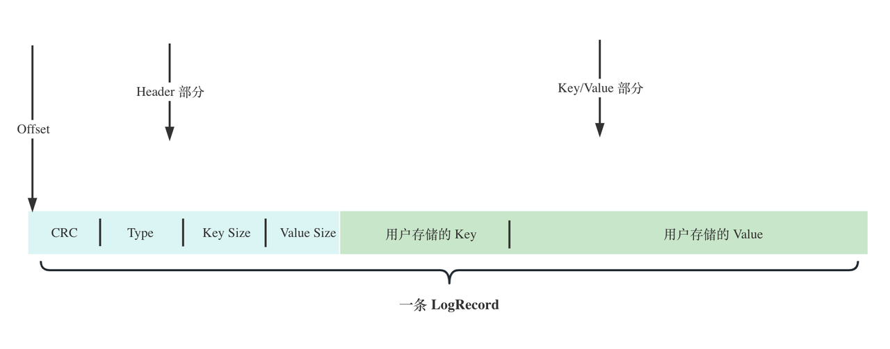

## 数据库启动流程

基于Bitcask论文实现的存储引擎实例，本质上是在本地当中维护一个文件夹，这其中包含了.data结尾的数据文件，merge完成的Hint文件，文件锁文件等。

### 参数校验

启动Bitcask时做参数校验应该考虑：

- 当前目录是否存在，是否为一个新的实例
- 对于DataFile、MergeRatio的参数合法性校验

### 文件锁

在原文当中Bitcask提出可由多个进程同时读，但是只能由一个进程写，在实际实现中为了避免并发问题，只允许一个进程进行读写操作，相当于只允许打开一个服务端。

通过系统调用flock提供的文件锁，保证多个进程之间的互斥，在启动数据库时，通过判断是否能够获取对应文件锁，来保证单个进程运行数据库。

### 初始化DB实例

主要包含了以下参数：

- 配置参数
- 读写锁
- 旧的文件（只读，不写入）
- 索引
- 是否初始化
- 文件锁

### 加载merge文件

merge后的文件目录存放在父级目录同名之下的文件夹当中，如果不存在说明没有发生过合并。

如果存在merge目录，遍历目录下的文件，判断是否存在mergeFinished文件，来判断merge操作是否有效，mergeFinished文件中存放了完成merge的文件序列号，未完成merge的部分后续需要手动加载索引信息。

在判断merge有效性后，删除旧文件，移动新文件到目录当中覆盖，最后删除merge目录。

### 加载数据文件

因为内存中维护的是key-value的数据信息在磁盘中的位置，这里需要提前加载好数据文件，每次打开数据库都需要重新构造索引信息，查询时先从内存中找到位置信息，再从文件中读取。

在本项目中将.data后缀的文件作为数据文件，并且这里根据文件名排序，实现有序数据文件，便于后续有序加载索引（记录是追加写入到磁盘中的文件的，相同Key的记录，后加载应该是最新的有效数据，用来更新已经加载的数据）。

在加载数据文件时，加载文件的名，作为后续olderFiles的编号。

加载到最后一个文件，是当前实例的活跃文件，所有新增或者删除记录都是追加写入到活跃文件当中的，其他文件作为olderFile只用于读。

### 加载索引

在磁盘中当中只保存了数据文件，每次打开数据库是需要重新加载索引信息到内存当中的。当然如果此时发生了merge操作，merge操作完会生成所有有效信息的一个Hint索引文件，未merge的数据文件还需要手动构造加载索引信息。

读取数据文件中的每一条记录，进行解码得到信息，构造Value信息：

- 解析记录的末尾序列号，如果是nonTransactionSeqNo说明是普通记录，可以更新
- 如果是事务ID，暂存记录到内存中，直到读取到事务ID结束的记录，加载这些记录到内存当中
- 记录最新的事务序列号，加载到DB实例当中，保证后续全局唯一
- 注意最后一个文件的末尾信息offset，作为活跃文件当前文件写入位置信息writeoff需要记录

在解析完Key后，如果是普通索引，或者完整事务记录信息，更新内存索引，Key：key，Value：Fid + Offset + size。

如果序列号是事务序列号，需要判断是否完成，完成统一加载索引信息，否则丢弃。

其中B+树索引，使用了开源的BBlot，索引信息实际上是维护一个DB实例。每次加载数据库时，索引信息不需要通过数据文件加载，直接打开DB实例即可。由于没有读取数据文件，最新的事务序列号要通过一个seqNoFile文件进行获取，同时为了后续追加写入读取完后删除，在关闭数据库时写入一条记录到seqNoFile文件当中。

## 索引结构设计

在内存当中，我们需要一种支持高效插入、读取、删除数据的结构，并且如果需要数据高效遍历的话，我们最好是选择天然支持有序的一种结构。常见的选择有BTree、跳表、红黑树等。

在设计内存索引结构时，考虑到实际场景需要实现不同的内存索引结构，设计了抽象的内存索引接口：

```go
type Indexer interface {
	// Put 向索引结构中存储 key 对应的数据位置信息
	Put(key []byte, pos *data.LogRecordPos) *data.LogRecordPos

	// Get 从索引结构中获取 key 对应的数据位置信息
	Get(key []byte) *data.LogRecordPos

	// Delete 从索引结构中删除 key 对应的数据位置信息
	Delete(key []byte) (*data.LogRecordPos, bool)

	// Size 索引中数据量
	Size() int

	// Iterator 获取索引结构的迭代器
	Iterator(reverse bool) Iterator

	// Close 关闭索引
	Close() error
}
```

在本项目中，主要结合Bitcask论文实现存储引擎实例，索引部分设计不是重点，主要利用现有的索引实现相应的功能。主要采用了三种索引结构，BTree，ARTree以及B+Tree。

### BTree

在一开始中只是先使用[BTree](https://github.com/google/btree)实现了，BTree是一种常用的多叉树数据结构，主要用于管理大量数据并允许高效的插入、删除和搜索操作。具有以下特点：

- **多叉树结构**：B树是一种多叉树，每个节点可以拥有多个子节点，通常用于处理大量数据，减少树的高度。
- **平衡性**：B树是一种自平衡树，保持平衡是其重要特征，通过旋转和分裂等操作保持树的平衡，确保操作的时间复杂度稳定。
- **有序存储**：B树节点中的元素是有序存储的，使得在节点内部可以进行快速查找。

### ARTree

ARTree是自适应基树，可以看成是一个前缀树的优化版本，如果子节点只有一个值，则会和父节点进行合并，减少空间占用。实际中使用了封装[go-adaptive](https://github.com/plar/go-adaptive-radix-tree)实现ART索引结构。

ARTree节点有多个类型，比如Node4，Node16。对于Node4：使用一个长度为4的数组来存储子节点的键，另外一个长度为4的数组来存储指向子节点的指针。

随着键的插入和删除，节点可能需要进行升级或降级以匹配子节点的数量。通过动态调整子节点的大小，实现空间的高效利用和查询性能优化。

### B+Tree

从 bitcask 论文中可以得知，Bitcask存储模型的最大特点是所有的索引都只能在内存中维护，这样的特性带来了一个好处，维护在内存中的索引信息**一次磁盘 IO 操作就可以拿到数据**了。同时也限制了存储引擎能维护多少索引，完全取决于内存容量。

针对这个问题可以考虑**将索引信息维护到磁盘当中**，牺牲一定的读写性能，节省内存空间。

对于go语言通过使用[boltdb](https://crates.io/crates/jammdb)这个库，其实现了标准的B+树。在学习MySQL时了解InnoDB存储引擎下的数据结构是B+Tree，其是一个磁盘IO友好型的数据结构。在相同数据量下，树的高度更低，这意味着需要较少次数的IO。并且在叶子节点之间通过链表连接，可以实现双先遍历，支持范围查询。

> 如果DB使用B+树索引，不会从数据文件中加载索引，那么对于WriteBatch有一定的影响，无法获取最新的事务序列号。
>
> 可以考虑加载数据文件获取最新序列号，或者直接禁用WriteBatch，或者数据库Close时候，最新的序列号记录到一个文件当中，启动时从文件中获取。
>
> 但是在数据库异常情况下没有正常Close，会导致序列号没有正常写入，因此实际中可以考虑禁用WriteBatch功能。

### 索引迭代器设计

考虑到不同的索引结构，将索引迭代器设计成一个通用的接口，方便不同的索引接口实现迭代器。

```go
type Iterator interface {
	Rewind()                   // 重新回到迭代器的起点
	Seek(key []byte)           // 从索引结构中查找 key, 从这个位置开始遍历
	Next()                     // 跳转下一个Key
	Valid() bool               // 是否有效，即是否已经遍历完了所有的 key，用于退出遍历
	Key() []byte               // 获取当前 key
	Value() *data.LogRecordPos // 获取当前 key 对应的数据位置信息
	Close()                    // 关闭迭代器
}
```

对于B树来说，通过将当前的所有值拷贝到一个value数组中，通过遍历下标方式获取指定的值。

### 索引锁粒度优化

在之前的设计中，内存中只有一个索引的结构，所有的写入和读取都会竞争这个索引数据结构的锁，在高并发的场景下，这可能会是一个性能瓶颈。

我们可以将这个锁的粒度减小，使用多个索引结构，然后将 key 通过 hash 取模映射到不同的索引数据结构中。

这样一来，只有映射到相同索引之中的 key 才会竞争同一把锁，这避免了去维护一个全局索引锁，大大减少了锁的粒度，并发性能能够得到提升。

## 数据清理

在这之前我们提到了，数据写入和删除都是写入一条数据记录，当删除一条记录时写入一条墓碑记录到数据文件，再更新内存索引，在这之前的记录也就无效了；在使用watchbatch批量写入时，当写入中途失败时（数据库崩溃），导致记录无效，这些无效数据会占用一定的无效空间。

因此在Bitcask论文中，考虑通过merge操作，将有效的数据进行重写，同时可以生成针对有效数据的索引信息，在启动数据库时直接加载，而不需要重复构造，有利于在数据库崩溃时快速加载，采用和写入数据文件一样的方式，不过存储的value信息，是key所在的磁盘位置信息，Fid，Offset，Size信息。

为了避免进行merge操作时，导致正常业务的阻塞，通过将数据文件拷贝到另一个文件夹中，进行操作，不影响业务正常的运行：

- 当前活跃文件转为olderFile，并打开新的文件作为activeFile写入
- 将olderFile直接拷贝到其他文件夹中（merge后缀标记）
- 注意检查当前磁盘空间是否够完成merge操作，是否达到merge的上限阈值
- 完成文件拷贝后，可以释放锁，此时备份库和正在运行的库不存在冲突问题
- 新建一个Bitcask实例，以及一个Hint文件存放有效记录的索引信息
- 读取mergeFile每一条记录，对比索引内的信息，如果一致说明有效，清除事务标记，写入到Hint文件中
- 持久化后，写表示mergeFinishFile的文件，并且写入未完成merge的文件id

## 数据读写操作

### 数据记录的格式



一条数据记录主要包括了以下几个字段：

- CRC占用4个字节，用于校验记录的有效性
- Type占用1个字节，用来表示记录的类型
- KeySize、ValueSize使用变长（最大5个字节），表示后面Key和Value的长度
- 以上作为LogRecord的Header部分，Header是固定长度的，读取一条记录时先读取header部分，解析后多余的字节会忽略，反序列号后得到KeySize和ValueSize的信息

- Key/Value部分也是变长的

> 通过将字段设计为变长，节省了存储空间。如果keysize是u32类型，不使用变长，将固定占据4字节，有的时候key长度很小，例如长度为5，只需要1个字节存储。

### 写入记录

在写入一条记录之前，对Key进一步编码，在前缀增加一个Seq，表示是普通记录，还是事务记录。在merge完成时会去除事务序列号。加载到内存中时加载时realKey。

- 使用1个字节存储Type
- 然后使用变长字段记录KeySize和ValueSize
- 将编码后的header拷贝到数组当中，然后拷贝key和value
- 最后做一个crc校验，插入到头部

写入一条记录时先写入Type，计算Key，Value的大小写入，再写入Key，Value，最后做一个CRC校验，写入记录的头部。

### 读取记录

- 拿到Header后，如果判断keySize和ValueSize均为0，则说明读取到了文件末尾，返回一个EOF错误
- 根据Offset + KeySize和ValueSize的总和，读取一个字节数组，包含了Key/Value的信息
- 再根据crc以后的几个字段，计算出crc值，对比header中的crc值进行校验

读取一条记录时，先读取头部信息，判断keySize和ValueSize是否有效，为0说明读取到了文件末尾，返回一个EOF错误；否则根据Header中的Size信息，读取Key和value信息；最后计算读取的header中除了crc字段，加上key，value计算得出的crc值，与记录中的crc值是否一直，避免记录被破坏。

