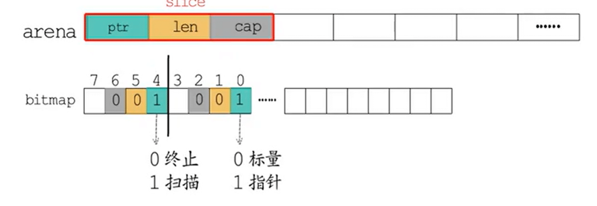

> 参考文章：
>
> 1. [幼麟实验室](https://space.bilibili.com/567195437)
> 2. [小徐先生的编程世界——内存模型与分配机制](https://mp.weixin.qq.com/s/2TBwpQT5-zU4Gy7-i0LZmQ)

## 内存模型

操作系统中经典的**多级存储模型**，寄存器、高速缓存、内存、磁盘，从左到右速度更慢，空间更大，价格更低。

另一个重要的概念是**虚拟内存**，其作用如下：

- 在用户与硬件间添加中间代理层（没有什么是加一个中间层解决不了的）
- 优化用户体验（进程感知到获得的内存空间是“连续”的）
- “放大”可用内存（虚拟内存可以由物理内存+磁盘补足，并根据冷热动态置换，用户无感知）

操作系统中通常会将虚拟内存和物理内存切割成固定的尺寸，于虚拟内存而言叫作**“页”**，于物理内存而言叫作**“帧”**，原因及要点如下：

- 提高内存空间利用（以页为粒度后，消灭了不稳定的外部碎片，取而代之的是相对可控的内部碎片）
- 提高内外存交换效率（更细的粒度带来了更高的灵活度）
- 与虚拟内存机制呼应，便于建立虚拟地址->物理地址的映射关系（聚合映射关系的数据结构，称为**页表**）
- linux 页/帧的大小固定，为 4KB（这实际是由实践推动的经验值，太粗会增加碎片率，太细会增加分配频率影响效率）

## golang内存模型

当程序运行起来所需分配的内存块有大有效，如果随机分配然后取用，分散的、大小不一的碎片化内存一方面会**降低内存的使用率**，也会增加下一次申请内存块的代价。

为了降低碎片化内存带来的影响，go采用了Tcmalloc内存分配器相似的算法。主要包括以下要点：

- 将内存页按照预制的大小规格进行分块，不同规格的内存块分到对应的空闲链表当中
- 程序申请内存是，分配器会优先根据申请的内存大小找到最匹配的规格，然后从对应的空闲链表中分配一个内存块

- 堆内存可以划分一块块64MB的Arena，每个Arena具体可以张开为8192个page，每个page即8K大小，page作为**最小的存储单元**

- 在这个基础上多个page又组合成不同的span，span中按照特定规格划分成等大的内存块，作为**最小的管理单元**

  

  - 同等级的span从属同一个mcentral，最中组织成一个链表（携带前后指针）
  - 这样同一个等级的span可以基于同一把互斥锁管理
  - 通过位图可以辅助快速找到空闲的内存块

- 管理堆内存的数据结构主要包括管理整个堆内存的mheap，管理其中每个Arena的heapArena，管理span的mspan，以及管理全局mspan的mcentral

- 不同P之间获取内存，为了并发安全，需要加锁

  - 为了保障多个p之间并发安全，降低p之间的竞争性，go语言每个p都有一个本地的小对象缓存，从这里取用不需要加锁，如图中的线程缓存mcache
  - mcache中包含了tiny alloc分配给小于16B的对象，以及每种spanClass等级的mspan
  - 当需要使用时优先从本地的cache获取，没有或者用完了某个规模，再去mcentral中申请，并在mcentral中是否用完

- heapArena中主要保存了各种重要的bitmap位图，用来记录各种状态，比如标记变量是指针还是标量，是否需要继续扫描等

  

  - heapArena 记录了页到 mspan 的映射. 因为 GC 时，通过地址偏移找到页很方便，但找到其所属的 mspan 不容易. 因此需要通过这个映射信息进行辅助

- 中心缓存mcentral一个数组，维护了68 * 2种span，每个mcentral下聚合了该spanClass下的mspan

  

  - 同一个mspanClass下又分为有空间的和满空间的链表
  - 每个mcentral中包含该类别的锁，降低的锁粒度

- 此时全局堆缓存mheap，对于golang上层应用而言，堆是操作系统虚拟内存的抽象

  - 将连续页组装成mspan，基于位图标记全局内存的使用情况（是否被组装）
  - 通过heapArena聚合页，记录页到mspan的映射信息
  - 建立空闲页基数树索引 radix tree index，辅助快速寻找空闲页
  - 持有所有 spanClass 下的 mcentral，作为自身的缓存
  - 内存不够时，向操作系统申请，申请单位为 heapArena（64M）

核心思想以空间换时间，一次缓存，多次使用，避免重复申请内存；同时堆作为Go运行时中最大的临界共享资源，每次存取需要加锁，通过mcache无锁化访问。

## golang分配对象流程

golang中根据对象的大小可以划分成三类

- tiny微对象：(0, 16B)
- small小对象：[16B, 32KB]
- large大对象：(32KB, ∞)

不同的对象，分配流程不同，在mallocgc方法中通过类似读取多级缓存形式获取，对于tiny从1到5，small执行2-5，large执行4-5步骤

1. 从 P 专属 mcache 的 tiny 分配器取内存（无锁）
2. 根据所属的 spanClass，从 P 专属 mcache 缓存的 mspan 中取内存（无锁）
3. 根据所属的 spanClass 从对应的 mcentral 中取 mspan 填充到 mcache，然后从 mspan 中取内存（spanClass 粒度锁）
4. 根据所属的 spanClass，从 mheap 的页分配器 pageAlloc 取得足够数量空闲页组装成 mspan 填充到 mcache，然后从 mspan 中取内存（全局锁）
5. mheap 向操作系统申请内存，更新页分配器的索引信息，然后重复（4）

